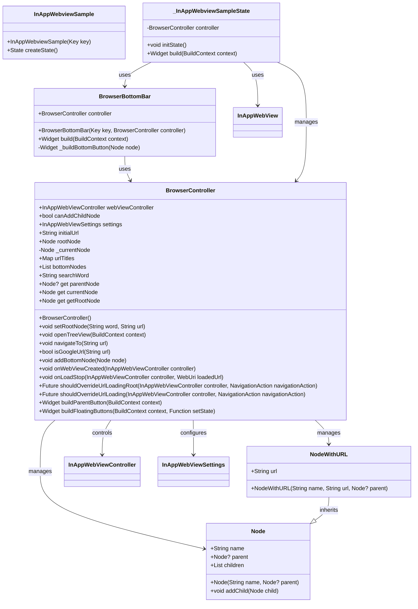

```mermaid
classDiagram
    class BrowserBottomBar {
        +BrowserController controller
        +BrowserBottomBar(Key key, BrowserController controller)
        +Widget build(BuildContext context)
        -Widget _buildBottomButton(Node node)
    }

    class BrowserController {
        +InAppWebViewController webViewController
        +bool canAddChildNode
        +InAppWebViewSettings settings
        +String initialUrl
        +Node rootNode
        -Node _currentNode
        +Map<String, String> urlTitles
        +List<Node> bottomNodes
        +String searchWord
        +BrowserController()
        +void setRootNode(String word, String url)
        +Node? get parentNode
        +Node get currentNode
        +Node get getRootNode
        +void openTreeView(BuildContext context)
        +void navigateTo(String url)
        +bool isGoogleUrl(String url)
        +void addBottomNode(Node node)
        +void onWebViewCreated(InAppWebViewController controller)
        +void onLoadStop(InAppWebViewController controller, WebUri loadedUrl)
        +Future<NavigationActionPolicy> shouldOverrideUrlLoadingRoot(InAppWebViewController controller, NavigationAction navigationAction)
        +Future<NavigationActionPolicy> shouldOverrideUrlLoading(InAppWebViewController controller, NavigationAction navigationAction)
        +Widget buildParentButton(BuildContext context)
        +Widget buildFloatingButtons(BuildContext context, Function setState)
    }

    class InAppWebviewSample {
        +InAppWebviewSample(Key key)
        +State createState()
    }

    class _InAppWebviewSampleState {
        -BrowserController controller
        +void initState()
        +Widget build(BuildContext context)
    }

    class Node {
        +String name
        +Node? parent
        +List<Node> children
        +Node(String name, Node? parent)
        +void addChild(Node child)
    }

    class NodeWithURL {
        +String url
        +NodeWithURL(String name, String url, Node? parent)
    }

    BrowserBottomBar --> BrowserController : uses
    _InAppWebviewSampleState --> BrowserController : manages
    _InAppWebviewSampleState --> BrowserBottomBar : uses
    _InAppWebviewSampleState --> InAppWebView : uses
    BrowserController --> Node : manages
    BrowserController --> NodeWithURL : manages
    NodeWithURL --|> Node : inherits
    BrowserController --> InAppWebViewController : controls
    BrowserController --> InAppWebViewSettings : configures
```