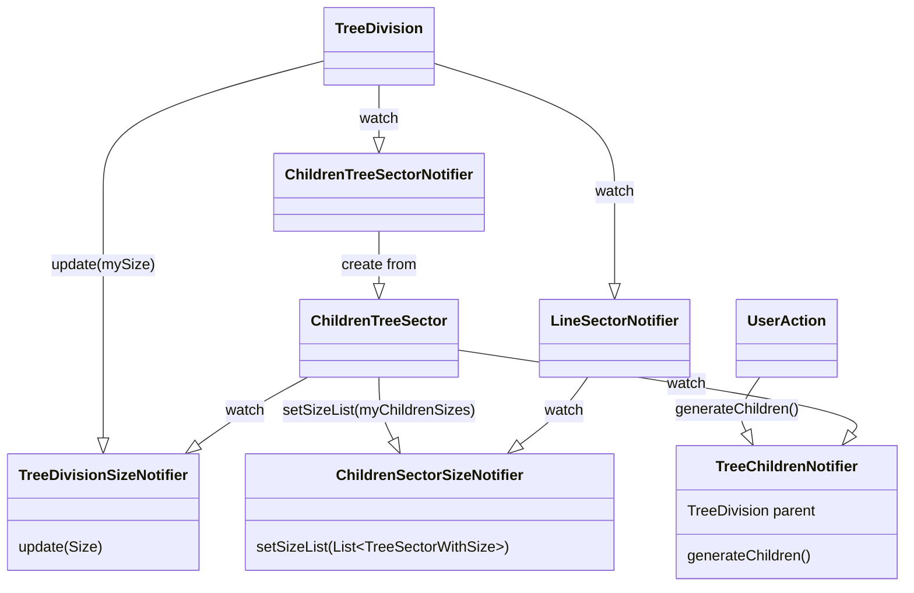

# ツリー表示関連処理

## Notifier一覧

- **treeChildrenNotifier**  
概要：TreeSector毎に子要素を管理する  
クラス：`TreeChildrenNotifier.family`  
場所：`tree_sector.dart`  
引数：TreeSector:`親要素`  
メソッド：`generateChildren()`：親要素のノードを参照し、子要素を生成する  
`removeChildren()`：子要素をからにする  

- **treeSectorSizeNotifer**  
概要：TreeSector毎にSizeを管理する  
クラス：`TreeSectorSizeNotifer.family`  
場所：`tree_sector.dart`  
引数：TreeSector:`自身のTreeSector`  
メソッド：`update(Size size)`：自身のサイズを更新する

- **childrenSectorSizeNotifier**  
概要：TreeSector毎に子要素のSizeを管理する  
クラス：`ChildrenSectorSizeNotifer.family`  
場所：`child/children_tree_sector.dart`  
引数：TreeSector:`親要素`  
メソッド：`setSizeList(List&lt;TreeSectorWithSize&gt; sectors)`：子要素のサイズリストを更新する  
`removeSize()`：子要素のサイズリストを空にする

- **lineSectorNotifier**
概要：TreeSector毎にLineSectorを管理する  
クラス：`LineSectorNotifier.family`  
場所：`child/children_tree_sector.dart`  
引数：TreeSector:`親要素`  
メソッド：``

## 処理順

- `TreeSector`が生成される
  - `ChildrenTreeSector`が生成される  
  - `treeChildrenNotifier`を監視する（children）  
  - childrenを作成する
  - postFrameCallback実行  
    - children内のTreeSectorで`treeSectorSizeNotifier`を監視
    - 親要素でchildrenSectorSizeNotifierを読み取り、setSizeListを実行  
- postFrameCallback実行
- 自身の大きさを取得(size)
- 自身でtreeSectorSizeNotiferを読み取りupdate(size)を実行
- 自身でlineSectorNotifierを監視
  - lineSectorNotifierはchildrenSectorSizeNotiferを監視

